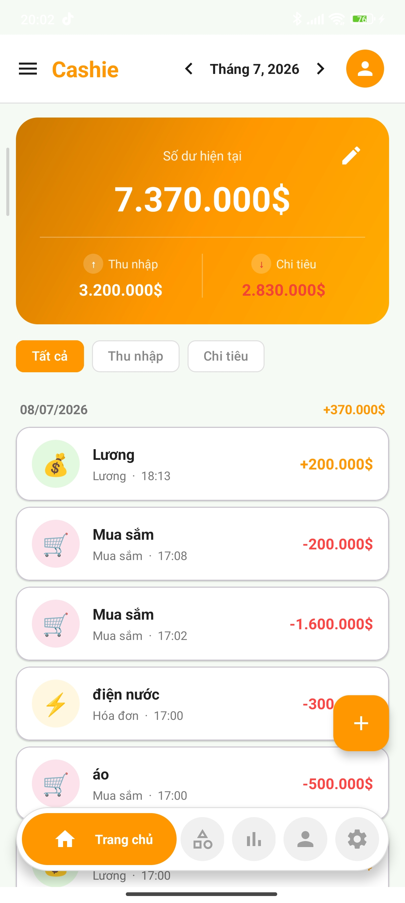
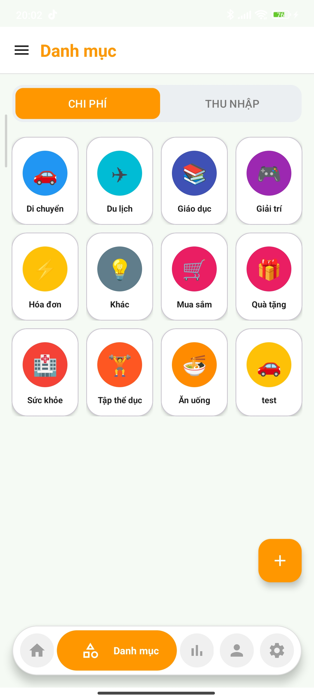
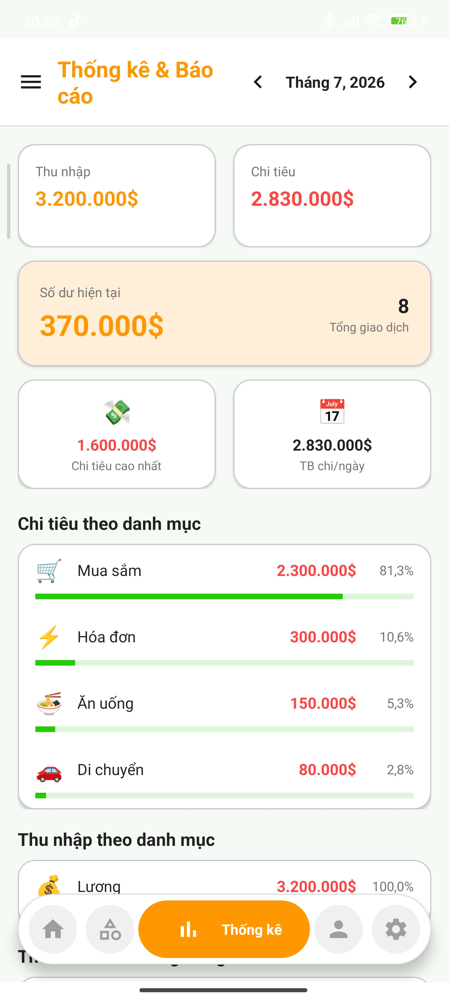
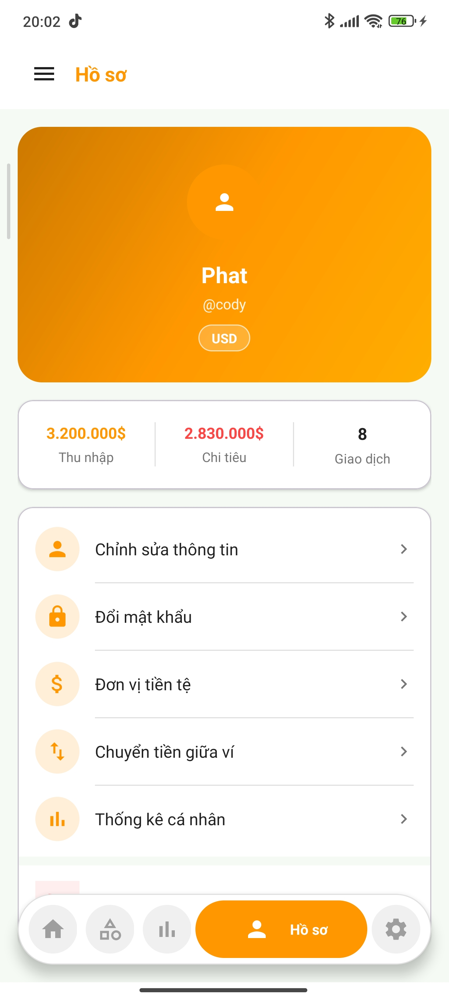
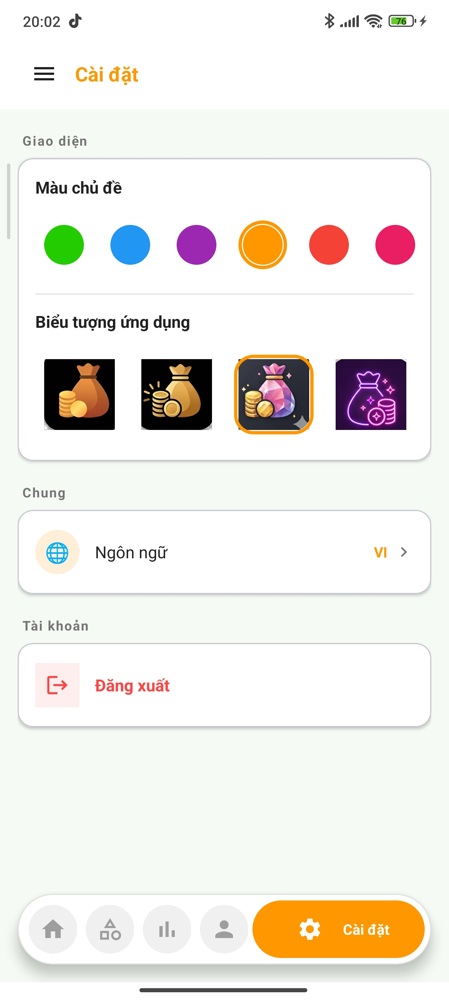
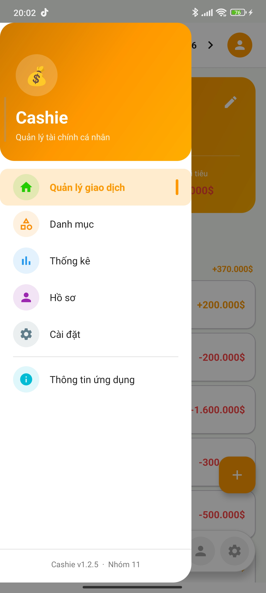

<div align="center">

# 💰 Cashie

### Quản lý tài chính cá nhân thông minh
### Smart Personal Finance Management

[](https://android.com)
[](https://kotlinlang.org)
[-blue)](https://developer.android.com)
[](https://github.com/W-Codyz/Cashie_Mobile_Group11)
[](LICENSE)

</div>

---

## 📖 Giới thiệu / Overview

**VI:** Cashie là ứng dụng Android quản lý tài chính cá nhân, giúp người dùng theo dõi thu nhập, chi tiêu và phân tích ngân sách một cách trực quan. Đây là đồ án môn **Lập trình Thiết bị di động** tại **ĐH Giao thông Vận tải TP.HCM**, được thực hiện bởi **Nhóm 11**.

**EN:** Cashie is a native Android personal finance app that helps users track income, expenses, and visualize their budget. This is a capstone project for the **Mobile Application Development** course at **Ho Chi Minh City University of Transport**, developed by **Group 11**.

---

## ✨ Tính năng / Features

| | Tính năng / Feature | Mô tả / Description |
|---|---|---|
| 💸 | **Quản lý giao dịch** / Transaction Management | Thêm, sửa, xóa giao dịch thu/chi với 16 danh mục emoji — Add, edit, delete income/expense transactions with 16 emoji categories |
| 📊 | **Thống kê** / Statistics | Biểu đồ donut theo quý, biểu đồ cột theo tuần, so sánh tháng — Quarterly donut chart, weekly bar chart, month-on-month comparison |
| 👤 | **Hồ sơ cá nhân** / Profile | Xem/chỉnh sửa thông tin, đổi mật khẩu, tổng quan tháng — View/edit info, change password, monthly summary |
| 🎨 | **Cá nhân hóa** / Personalization | 11 màu theme, 10 biểu tượng ứng dụng, ngôn ngữ Tiếng Việt/English — 11 theme colors, 10 dynamic app icons, VI/EN language |
| 🔐 | **Xác thực** / Authentication | Đăng ký/đăng nhập với mã hóa SHA-256, lưu phiên đăng nhập — Register/login with SHA-256 hashing, persistent session |
| 🗂️ | **Danh mục** / Categories | Quản lý danh mục thu/chi với màu sắc tùy chỉnh — Manage income/expense categories with custom colors |

---

## 📸 Screenshots

<div align="center">

| Trang chủ | Danh mục | Thống kê |
|:---------:|:--------:|:--------:|
|  |  |  |

| Hồ sơ | Cài đặt | Điều hướng |
|:-----:|:-------:|:----------:|
|  |  |  |

</div>

---

## 🛠️ Tech Stack

| Layer | Technology |
|---|---|
| Language | Kotlin 2.0.20 |
| UI | Android Views (XML) + ViewBinding |
| Architecture | MVVM — ViewModel + LiveData |
| Navigation | Jetpack Navigation Component 2.7.7 |
| Database | Room 2.6.1 (SQLite ORM + KSP) |
| UI Components | Material Design 3, RecyclerView, ConstraintLayout |
| Build System | Gradle 8.13.2 · AGP · KSP 2.0.20-1.0.25 |
| Min SDK | 24 (Android 7.0 Nougat) |
| Target SDK | 36 (Android 15) |
| JVM Target | Java 11 |

---

## 📁 Cấu trúc dự án / Project Structure

```
app/src/main/java/com/uth/cashie/
│
├── Activities/                  # 12 màn hình chính / 12 main screens
│   ├── LoginActivity            # Đăng nhập
│   ├── RegisterActivity         # Đăng ký
│   ├── SetupActivity            # Thiết lập ban đầu
│   ├── MainActivity             # Trang chủ — danh sách giao dịch
│   ├── AddTransactionActivity   # Thêm / chỉnh sửa giao dịch
│   ├── StatsActivity            # Thống kê
│   ├── ProfileActivity          # Hồ sơ
│   ├── EditProfileActivity      # Chỉnh sửa hồ sơ
│   ├── ChangePasswordActivity   # Đổi mật khẩu
│   ├── SettingActivity          # Cài đặt (theme, icon, ngôn ngữ)
│   ├── CategoryMainActivity     # Danh mục
│   └── AboutActivity            # Thông tin ứng dụng & nhóm
│
├── database/
│   ├── CashieDatabase.kt        # Room DB — 5 bảng
│   ├── SessionManager.kt        # Quản lý phiên đăng nhập
│   ├── dao/                     # UserDao, TransactionDao, CategoryDao, ...
│   ├── entity/                  # UserEntity, TransactionEntity, ...
│   └── util/                    # DateUtils, PasswordUtils (SHA-256)
│
├── stats/                       # Module thống kê
│   ├── StatsViewModel.kt
│   ├── StatsRepository.kt
│   └── DonutChartView.kt        # Custom view biểu đồ donut
│
├── category/                    # Module danh mục
├── adapter/                     # RecyclerView Adapters
├── data/                        # Repositories, Models
└── manager/                     # ThemeManager, IconManager, NavMenuHelper
```

---

## 🗄️ Database Schema

```
users           → Tài khoản người dùng, thông tin đăng nhập
transactions    → Giao dịch thu/chi (liên kết user & category)
categories      → Danh mục giao dịch (có màu & emoji)
app_settings    → Cài đặt người dùng (theme, ngôn ngữ, icon)
saved_accounts  → Quản lý ví / tài khoản
```

> Tất cả các bảng liên kết qua foreign key với CASCADE delete khi xóa người dùng.

---

## 🚀 Hướng dẫn cài đặt / Getting Started

### Yêu cầu / Prerequisites

- Android Studio Hedgehog (2023.1.1) trở lên
- JDK 11+
- Android SDK API 24+

### Chạy dự án / Build & Run

```bash
# Clone repository
git clone https://github.com/W-Codyz/Cashie_Mobile_Group11.git

# Mở bằng Android Studio và chờ Gradle sync
# Open with Android Studio and wait for Gradle sync

# Chạy trên máy ảo (API 24+) hoặc thiết bị thực
# Run on emulator (API 24+) or physical device
```

> Không cần API key hay biến môi trường. App sử dụng Room database cục bộ.
> No API keys or environment variables required. App uses a local Room database.

---

## 📦 Danh mục giao dịch / Transaction Categories

**Chi tiêu / Expense (11):**
`Ăn uống` · `Di chuyển` · `Mua sắm` · `Hóa đơn` · `Giải trí` · `Sức khỏe` · `Giáo dục` · `Thể dục` · `Du lịch` · `Quà tặng` · `Khác`

**Thu nhập / Income (5):**
`Lương` · `Thưởng` · `Đầu tư` · `Thu nhập khác` · `Khác`

---

## 👥 Nhóm thực hiện / Team

> **Đồ án môn:** Lập trình Thiết bị di động
> **Giảng viên hướng dẫn:** ThS. Huỳnh Thanh Việt
> **Trường:** ĐH Giao thông Vận tải TP.HCM — **Nhóm 11**

| Họ và tên | MSSV | Vai trò |
|---|---|---|
| Đặng Thành Đình Phát | 052205008286 | Nhóm trưởng / Leader |
| Lê Duy Mạnh | 052205008936 | Thành viên / Member |
| Phan Dương Khang | 052205008668 | Thành viên / Member |
| Nguyễn Tấn Đạt | 052205009161 | Thành viên / Member |
| Huỳnh Phúc Đạt | 052205001953 | Thành viên / Member |

---

<div align="center">

**Phiên bản 1.2.5 · © 2026 Nhóm 11 — ĐH Giao thông Vận tải TP.HCM**

*Dự án được thực hiện vì mục đích học thuật / Developed for educational purposes*

</div>
